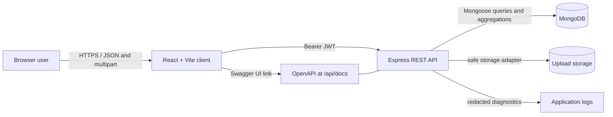
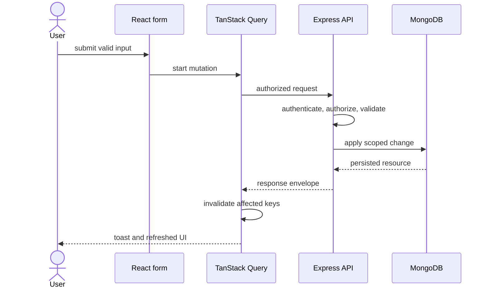

# CountryEdu NexaTask architecture

## Document status

This document explains the implemented TypeScript MERN architecture and its deliberate hackathon
trade-offs. The executable source remains authoritative; executed verification is recorded in
[FINAL_QA.md](./FINAL_QA.md).

## System context

CountryEdu NexaTask is a browser-based project and task management system for three organization roles: `ADMIN`, `PROJECT_MANAGER`, and `TEAM_MEMBER`. The browser calls a REST API. The API is the only trusted authorization boundary and persists application data in MongoDB. Task files use a replaceable storage service, with local disk as the hackathon default.



For local development, MongoDB runs locally while the client and server run through the root npm
workspace. The supported hosted layout is the client on Vercel, the API on Render, and MongoDB on
Atlas. Render's free ephemeral filesystem must not be treated as durable attachment storage.

## Monorepo boundaries

```text
countryedu-nexatask/
├── client/                 React application
│   └── src/
│       ├── components/     shared UI and authenticated layout pieces
│       │   ├── common/
│       │   └── layout/
│       ├── features/
│       │   └── auth/       authentication context and form schemas
│       ├── hooks/          reusable client hooks
│       ├── lib/            Axios and formatting/access utilities
│       ├── pages/          auth, dashboard, project, task, admin, and system screens
│       ├── routes/         route definitions and guards
│       ├── test/           shared Vitest render/setup utilities
│       ├── types/          shared client-side contracts
│       ├── App.tsx         route composition
│       ├── index.css       Tailwind layers and shared styles
│       └── main.tsx        browser entry point
├── server/
│   └── src/
│       ├── config/         validated environment and database setup
│       ├── middleware/     authentication, validation, and error handling
│       ├── modules/        auth/users/projects/tasks/comments/etc.
│       ├── scripts/        development seed entry point
│       ├── shared/         small cross-module helpers and types
│       ├── tests/          isolated integration suites
│       ├── types/          Express type augmentation
│       ├── app.ts          Express composition without listening
│       └── server.ts       startup, database connection, and shutdown
├── docs/                   architecture and operating guides
├── render.yaml             Render API Blueprint
└── package.json            workspace orchestration scripts
```

Dependencies should point inward toward small domain services. Route files declare HTTP concerns, controllers translate requests/responses, services enforce business and authorization rules, and Mongoose models persist data. A repository/factory/event-bus layer is not needed for this scope.

## Frontend architecture

### Application shell

The client has public and authenticated layouts. The authenticated layout owns the responsive sidebar/mobile navigation, top header, and profile/logout menu. Route metadata controls which navigation entries are visible, but visibility is a usability feature only; the API independently rechecks every permission.

Routes are grouped as follows:

- Public: Login, Register, and Not Found.
- Authenticated: Dashboard, Projects, Project Details, My Tasks, Task Details, and Profile.
- Admin: User Management, Audit Logs, Create/Edit Project, and project manager/member administration.
- Admin or assigned Project Manager: task creation/editing/assignment and allowed project member administration.

### State and data flow

- TanStack Query owns server state, caching, request status, mutation state, and targeted invalidation.
- React Hook Form and Zod own form state and immediate user-facing validation.
- A central Axios instance reads `VITE_API_BASE_URL`, attaches `Authorization: Bearer <token>`, normalizes API errors, and clears the session on an authenticated `401`.
- Small authentication context/state stores the current token/user and logout action. Project/task/user collections are not copied into a global client store.
- Search, filtering, sorting, and pagination values are expressed as URL query state where practical. Data is queried from the server; client-side array filtering is not a substitute.

For the hackathon, a JWT may be stored in `localStorage`. This survives refreshes but is readable by JavaScript and therefore exposed if an XSS vulnerability exists. It must not be described as completely secure. A production hardening path is short-lived access tokens plus rotating, `HttpOnly`, `Secure`, `SameSite` refresh cookies and an explicit CSRF strategy.

### Mutation flow



Destructive mutations require a confirmation dialog. All mutations expose disabled/loading states to prevent accidental duplicate submission.

## Backend architecture

### Request pipeline

The middleware order should be deterministic:

1. Trust-proxy policy (only when deployment topology requires it).
2. Helmet and configured CORS.
3. Request correlation/logging with sensitive-field redaction.
4. JSON/form parsing with conservative limits.
5. Public health and API documentation routes.
6. Rate-limited authentication routes.
7. JWT authentication for protected routes.
8. Route-level role checks and resource-level service authorization.
9. Zod validation for params/query/body; Multer for the single upload endpoint.
10. Controllers and services.
11. Not-found middleware.
12. Central error mapping and safe response serialization.

`app.ts` composes Express without opening a port, which lets Supertest exercise the real routing stack. `server.ts` validates configuration, connects MongoDB, listens, and handles graceful shutdown.

### Module responsibilities

| Module        | Main responsibility                                                  |
| ------------- | -------------------------------------------------------------------- |
| `auth`        | Registration, login, current user, password comparison, JWT issuance |
| `users`       | Admin-only user search/detail, role changes, activation changes      |
| `projects`    | Project CRUD, manager assignment, membership, scoped list access     |
| `tasks`       | Task CRUD, assignment, status workflow, My Tasks, scoped list access |
| `comments`    | Task comments with ownership and moderation rules                    |
| `attachments` | Metadata plus safe storage adapter operations                        |
| `dashboard`   | Role-scoped MongoDB aggregations                                     |
| `audit`       | Safe event creation and Admin-only query API                         |

Controllers stay thin: extract validated input and authenticated identity, call a service, and send the documented envelope. Services load the minimum resources needed to enforce role plus project/task scope before mutations. Mongoose hooks may hash changed passwords, but business actions and audit summaries belong in explicit services where behavior is visible and testable.

### Authentication and authorization

A valid JWT identifies a user ID, not a trusted role snapshot. Protected requests load the current user (or otherwise verify current role/status) so deactivation and role changes take effect. Authentication rejects a missing/invalid token with `401`; an authenticated user outside the allowed role/resource scope receives `403`.

Authorization combines role and resource scope:

| Capability                   | Admin                              | Project Manager               | Team Member                       |
| ---------------------------- | ---------------------------------- | ----------------------------- | --------------------------------- |
| Organization users and roles | Full                               | None                          | None                              |
| Projects                     | All                                | Assigned projects             | Member projects                   |
| Project create/delete        | Yes                                | No                            | No                                |
| Project update               | All                                | Assigned only                 | No                                |
| Manager assignment           | Yes                                | No                            | No                                |
| Project membership           | All                                | Assigned only                 | No                                |
| Task management              | All projects                       | Assigned projects             | No create/delete/reassign         |
| Own assigned task status     | Yes                                | Yes                           | Yes                               |
| Comments                     | Accessible tasks; Admin moderation | Assigned projects; moderation | Accessible tasks; own edit/delete |
| Attachments                  | Accessible tasks                   | Assigned projects             | Accessible tasks                  |
| Dashboard                    | Organization scope                 | Assigned projects             | Relevant projects/assigned work   |
| Audit query                  | Full                               | None                          | None                              |

Shared access helpers should express facts such as `canAccessProject`, `canManageProject`, and `canAccessTask`. Controllers must not accept a frontend-supplied role as authority.

### Validation and safe queries

- Zod schemas validate body, path IDs, query enums, ISO dates, positive page/limit values, and allow-listed sort fields.
- Pagination uses a configured maximum limit and returns complete metadata.
- User-provided search text is escaped before it becomes a regular expression, or a safe indexed search alternative is used.
- Mongoose ObjectIds are validated before querying and invalid IDs produce `400`, not an internal error.
- Date ranges require `from <= to`; project deadlines require `deadline >= startDate`.
- Manager/assignee/member references are resolved and checked for activity, role, and project membership.
- Mutations whitelist writable fields; clients cannot overwrite `createdBy`, timestamps, `completedAt`, or audit identity.

### Persistence and consistency

MongoDB collections are described in [ERD.md](./ERD.md). Projects retain a manager reference and a deduplicated member reference array. Tasks reference one project and an optional assignee. Comments, attachments, and audit logs are separate collections so their lifecycles and list queries remain bounded.

Operations spanning database metadata and a filesystem are not fully transactional. The attachment service should use compensating cleanup:

- Verify access and file constraints before storing metadata.
- If metadata persistence fails after writing a file, remove the newly written file.
- On deletion, authorize and remove metadata, then remove the physical file; a missing physical file is handled without exposing a path.
- Record an audit event only for a completed business operation.

Project deletion policy must be explicit in implementation. For a hackathon, a transaction-backed cascade of tasks, comments, and attachment metadata/files is preferable if implemented and tested; otherwise deletion must be rejected while dependent tasks exist. Silent orphan creation is not acceptable.

### Dashboard aggregations

Every dashboard pipeline begins with a role-derived visibility match:

- Admin: all organization records.
- Project Manager: projects where `managerId` is the current user.
- Team Member: projects containing the user, with task-personal metrics limited to their assigned work where the endpoint semantics require it.

Project progress is `completedTaskCount / totalTaskCount * 100`; a project with zero tasks returns `0`. Overdue means a non-completed task with `dueDate` before the current instant. Upcoming deadlines include accessible project deadlines and task due dates from now through seven days ahead. Tests should inject/freeze time at the service boundary.

## API contracts

All API responses use one of three shapes:

```json
{ "success": true, "message": "Optional message", "data": {} }
```

```json
{
  "success": true,
  "data": [],
  "pagination": {
    "page": 1,
    "limit": 10,
    "totalItems": 25,
    "totalPages": 3,
    "hasNextPage": true,
    "hasPreviousPage": false
  }
}
```

```json
{ "success": false, "message": "Project not found.", "errors": [] }
```

Expected status classes are `200` for reads/updates, `201` for creation, a consistent `200` JSON response or `204` for deletion, `400` validation, `401` authentication, `403` authorization, `404` missing resources, `409` conflicts, `429` rate limiting, and `500` unexpected failures. See [API.md](./API.md) for the complete route contract.

## Security posture

- Passwords are hashed with bcrypt and never logged or serialized.
- JWT secrets, database URLs, and deployment credentials live only in environment configuration.
- CORS uses an explicit client-origin allowlist rather than `*` for authenticated production traffic.
- Helmet supplies baseline browser security headers.
- Authentication endpoints are rate-limited.
- Uploads are size/type checked; stored names are generated; the configured directory is outside source code.
- Request logs exclude Authorization headers and redact credential fields.
- Error responses exclude stack traces, MongoDB internals, paths, and environment data.
- Audit metadata contains safe changed-field summaries, never raw sensitive request bodies.
- Swagger examples and seed accounts contain demo-only data.

## Operational design

The API exposes a health/readiness endpoint that checks MongoDB without revealing the connection
string. On shutdown it stops accepting traffic, closes the HTTP server, and disconnects Mongoose.
Render uses this endpoint for service health checks.

Local logs may be human-readable; production logs should remain structured enough for a hosting provider to search, but must not include passwords, JWTs, or uploaded file paths. Local upload storage requires a mounted volume. Stateless horizontal API scaling requires shared object storage and a durable attachment URL strategy.

## Deliberate hackathon trade-offs

- One deployable client and one deployable API keep operations understandable.
- REST and explicit services avoid unnecessary event buses and command frameworks.
- JWT in browser storage is acceptable only as a documented hackathon trade-off.
- Local disk uploads are suitable for local demos, not inherently durable on ephemeral hosts.
- Audit entries are application-level records, not a tamper-proof compliance ledger.
- Search uses bounded, escaped database queries; a dedicated search service is unnecessary at this scale.

## Documentation synchronization

Before final acceptance, compare this target to the actual package scripts, routes, Mongoose fields/indexes, environment schema, storage behavior, and role checks. Any implementation deviation must either be corrected or documented here and in the API/ERD guides; it must never be hidden by marking a QA row `PASS` without evidence.
