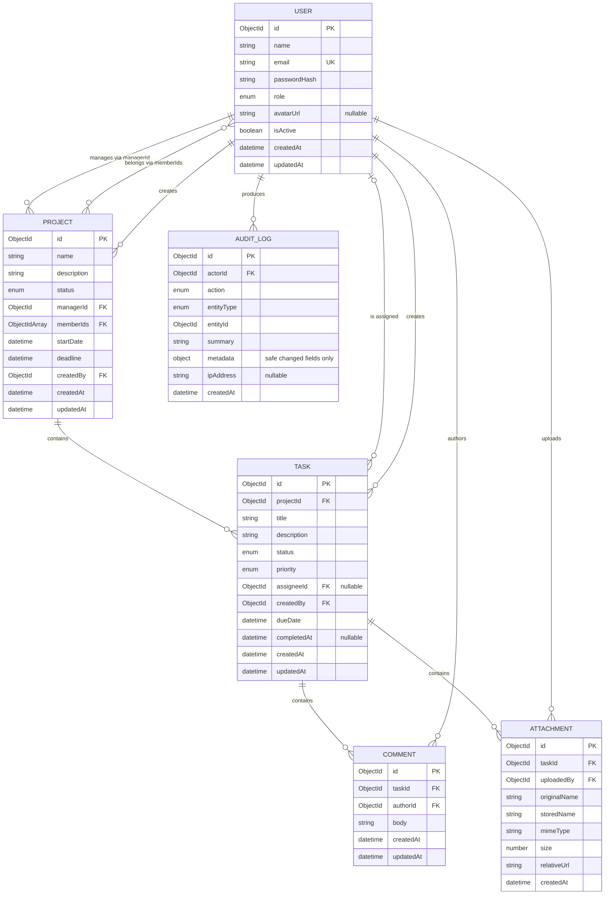

# CountryEdu NexaTask data model

## Document status

This diagram reflects the implemented MongoDB/Mongoose models in `server/src/modules`. See the
[database schema reference](./DATABASE_SCHEMA.md) for field-level required/default rules and the
model files for the executable definitions.

## Entity relationship diagram

MongoDB stores references as `ObjectId` values. API serializers expose them as string
`id`/reference values and never expose `passwordHash`.

The two User-to-Project relationships are different: `managerId` represents management scope,
while `memberIds` represents team access. Project creation and manager reassignment keep the
required manager in `memberIds`; MongoDB itself cannot enforce that cross-reference invariant.

## Enumerations and invariants

### User

- `role`: `ADMIN`, `PROJECT_MANAGER`, or `TEAM_MEMBER`; default `TEAM_MEMBER`.
- `isActive`: default `true`.
- `email`: required, trimmed/normalized to lowercase, and unique.
- `passwordHash`: required and selected/serialized only for internal authentication work.
- Password input is not stored as a field and must be at least eight characters before hashing.

### Project

- `status`: `PLANNING`, `ACTIVE`, `ON_HOLD`, or `COMPLETED`.
- `name`, `managerId`, `startDate`, `deadline`, and `createdBy` are required.
- `description` defaults to an empty string, `status` defaults to `PLANNING`, and `memberIds`
  defaults to an empty array.
- `deadline >= startDate`.
- `memberIds` contains unique IDs only.
- `managerId` identifies an active user whose role is `ADMIN` or `PROJECT_MANAGER`.
- Every member is active when assigned. Deactivation does not silently rewrite project history; authorization must immediately reject an inactive user.
- Service logic, not the document shape alone, ensures manager/member/reference access rules.

### Task

- `status`: `TODO`, `IN_PROGRESS`, or `COMPLETED`; default `TODO` where the create contract permits omission.
- `priority`: `LOW`, `MEDIUM`, or `HIGH`.
- `projectId`, `title`, `createdBy`, and `dueDate` are required.
- `assigneeId`, when present, identifies an active member of the referenced project.
- `completedAt` is set when status becomes `COMPLETED` and unset when reopened.
- An invalid status transition is rejected in the task service rather than relying only on the enum.

### Comment

- `body` is trimmed, required after trimming, and bounded to a reasonable maximum length.
- `taskId` and `authorId` are required.
- Ownership/moderation rules are evaluated through the comment's task and project.

### Attachment

- `originalName` is display metadata only and is never used as a path.
- `storedName` is a safe server-generated unique filename.
- `relativeUrl` is an authenticated application-relative download route, not an absolute server
  filesystem path.
- `size` is the accepted byte count; `mimeType` must be in the server allowlist.
- File bytes live in the configured storage system, while this document holds metadata.

### Audit log

- `actorId`, `action`, `entityType`, `entityId`, and `summary` are required. `actorId` identifies the
  user responsible for the event.
- `action` and `entityType` use allow-listed values rather than arbitrary client input.
- `summary` is a short human-readable safe description.
- `metadata` contains only safe identifiers/changed-field summaries; never passwords, JWTs, secrets, Authorization headers, or complete request bodies.
- Audit logs are append-only through the application API; no update/delete route is exposed.

## Relationship and lifecycle policy

MongoDB references do not enforce foreign keys. Each service must validate referenced entities before write operations:

1. Resolve and authorize the parent project/task.
2. Confirm referenced users exist and are active.
3. Confirm manager role or project membership as required.
4. Apply the mutation and create its audit entry only after successful business validation.

Project deletion removes the project's tasks, their comments, attachment metadata, and stored
files before deleting the project. Task deletion performs the corresponding comment, attachment,
and stored-file cleanup. If stored-file removal fails, the mutation returns an error instead of
silently leaving metadata and entity state inconsistent.

User records are deactivated rather than deleted, preserving ownership and audit references.

## Index plan

The table lists the indexes declared by the current Mongoose schemas, including indexes created by
field-level `index`/`unique` options.

| Collection    | Declared indexes                                                                                                                                                             |
| ------------- | ---------------------------------------------------------------------------------------------------------------------------------------------------------------------------- |
| `users`       | `{ email: 1 }` unique; `{ role: 1 }`; `{ isActive: 1 }`                                                                                                                      |
| `projects`    | `{ status: 1 }`; `{ managerId: 1 }`; `{ deadline: 1 }`; `{ memberIds: 1 }`; `{ name: 1 }`                                                                                    |
| `tasks`       | `{ projectId: 1 }`; `{ status: 1 }`; `{ priority: 1 }`; `{ assigneeId: 1 }`; `{ dueDate: 1 }`; `{ title: 1 }`; `{ projectId: 1, status: 1 }`; `{ projectId: 1, dueDate: 1 }` |
| `comments`    | `{ taskId: 1 }`; `{ authorId: 1 }`; `{ taskId: 1, createdAt: 1 }`                                                                                                            |
| `attachments` | `{ taskId: 1 }`; `{ uploadedBy: 1 }`; `{ storedName: 1 }` unique                                                                                                             |
| `auditlogs`   | `{ actorId: 1 }`; `{ action: 1 }`; `{ entityType: 1 }`; `{ entityId: 1 }`; `{ createdAt: -1 }`; `{ entityType: 1, entityId: 1 }`                                             |

The unique email and stored-name indexes enforce identity constraints. Project/task scope and date
indexes support role visibility, list filters, deadlines, and dashboard aggregation. Search uses
escaped, bounded regular expressions; ordinary single-field indexes do not make arbitrary
case-insensitive substring search an indexed full-text operation.

## Serialization contract

- Map MongoDB `_id` to API `id` consistently.
- Remove `__v` and `passwordHash` from JSON.
- Populate only safe user fields (`id`, `name`, `email`, `role`, `avatarUrl`, `isActive`) where a richer response is useful.
- Do not serialize absolute upload paths, internal stored secrets, raw driver errors, or hidden Mongoose state.
- Return dates as ISO 8601 UTC strings.

## Implementation references

The executable definitions are the Mongoose model files under `server/src/modules`. The
[database schema reference](./DATABASE_SCHEMA.md) gives the corresponding field tables, defaults,
validation limits, relationships, and lifecycle behavior in one evaluator-friendly document.
