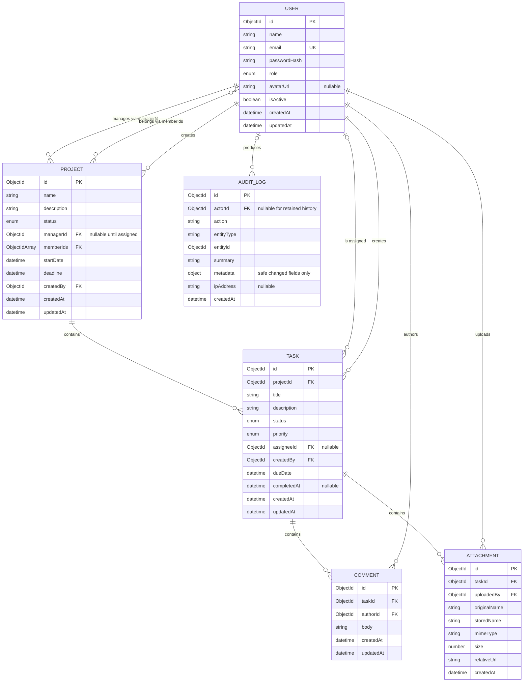

# CountryEdu NexaTask data model

## Document status

This is the target MongoDB/Mongoose model. Field names, collection behavior, indexes, and delete policy must be compared with the implementation before final QA; their presence here does not prove that migrations/index creation or runtime behavior was tested.

## Entity relationship diagram

MongoDB stores references as `ObjectId` values. API serializers should expose them as string `id`/reference values and must never expose `passwordHash`.

The two User-to-Project relationships are different: `managerId` represents management scope, while `memberIds` represents team access. A manager should also have access to the project by policy; the service must keep that invariant even though MongoDB cannot enforce it across documents.

## Enumerations and invariants

### User

- `role`: `ADMIN`, `PROJECT_MANAGER`, or `TEAM_MEMBER`; default `TEAM_MEMBER`.
- `isActive`: default `true`.
- `email`: required, trimmed/normalized to lowercase, and unique.
- `passwordHash`: required and selected/serialized only for internal authentication work.
- Password input is not stored as a field and must be at least eight characters before hashing.

### Project

- `status`: `PLANNING`, `ACTIVE`, `ON_HOLD`, or `COMPLETED`.
- `name`, `startDate`, `deadline`, and `createdBy` are required.
- `deadline >= startDate`.
- `memberIds` contains unique IDs only.
- `managerId`, when present, identifies an active user whose role is `ADMIN` or `PROJECT_MANAGER`.
- Every member is active when assigned. Deactivation does not silently rewrite project history; authorization must immediately reject an inactive user.
- Service logic, not the document shape alone, ensures manager/member/reference access rules.

### Task

- `status`: `TODO`, `IN_PROGRESS`, or `COMPLETED`; default `TODO` where the create contract permits omission.
- `priority`: `LOW`, `MEDIUM`, or `HIGH`.
- `projectId`, `title`, `createdBy`, and `dueDate` are required.
- `assigneeId`, when present, identifies an active member of the referenced project.
- `completedAt` is set when status becomes `COMPLETED` and unset when reopened.
- An invalid status transition is rejected in the task service rather than relying only on the enum.

### Comment

- `body` is trimmed, required after trimming, and bounded to a reasonable maximum length.
- `taskId` and `authorId` are required.
- Ownership/moderation rules are evaluated through the comment's task and project.

### Attachment

- `originalName` is display metadata only and is never used as a path.
- `storedName` is a safe server-generated unique filename.
- `relativeUrl` is an application-relative/public locator, not an absolute server filesystem path.
- `size` is the accepted byte count; `mimeType` must be in the server allowlist.
- File bytes live in the configured storage system, while this document holds metadata.

### Audit log

- `actorId` identifies the user responsible when one exists. Retention may require preserving logs after a user is removed, so implementations should avoid destructive user deletion.
- `action` and `entityType` use allow-listed values rather than arbitrary client input.
- `summary` is a short human-readable safe description.
- `metadata` contains only safe identifiers/changed-field summaries; never passwords, JWTs, secrets, Authorization headers, or complete request bodies.
- Audit logs are append-only through the application API; no update/delete route is exposed.

## Relationship and lifecycle policy

MongoDB references do not enforce foreign keys. Each service must validate referenced entities before write operations:

1. Resolve and authorize the parent project/task.
2. Confirm referenced users exist and are active.
3. Confirm manager role or project membership as required.
4. Apply the mutation and create its audit entry only after successful business validation.

Project deletion must have one documented, tested policy. A transaction-backed cascade may remove tasks, comments, attachment metadata, and local files. If reliable cascade cleanup is not implemented, deletion should return a conflict while dependents remain. It must not silently leave task/comment/attachment orphans.

Task deletion likewise must remove or explicitly reject dependent comments and attachments. Physical-file cleanup cannot be guaranteed by a MongoDB transaction, so the storage service needs compensating cleanup and diagnostic logging without exposing paths to clients.

User records should normally be deactivated, not deleted, preserving ownership and audit references.

## Index plan

Indexes must follow real query shapes and be verified with representative data. The following is the minimal target; it avoids indexing large text bodies or low-value fields without a query reason.

| Collection    | Index                                     | Unique | Query served                      | Rationale                                                                                     |
| ------------- | ----------------------------------------- | ------ | --------------------------------- | --------------------------------------------------------------------------------------------- |
| `users`       | `{ email: 1 }`                            | Yes    | Registration/login/exact lookup   | Enforces normalized email identity and makes login lookup direct                              |
| `users`       | `{ role: 1, isActive: 1, createdAt: -1 }` | No     | Admin role/status list            | Matches the required filters plus stable recent ordering; confirm usefulness with data volume |
| `projects`    | `{ managerId: 1 }`                        | No     | Project Manager visibility/filter | Fast scope match for assigned projects                                                        |
| `projects`    | `{ status: 1 }`                           | No     | Status filter/dashboard counts    | Supports a required list filter and aggregation grouping                                      |
| `projects`    | `{ deadline: 1 }`                         | No     | Deadline range/upcoming deadlines | Supports range scans in deadline order                                                        |
| `tasks`       | `{ projectId: 1 }`                        | No     | Project task list                 | Every project-task request begins with this scope                                             |
| `tasks`       | `{ assigneeId: 1 }`                       | No     | My Tasks/team performance         | Supports assigned-work visibility and counts                                                  |
| `tasks`       | `{ status: 1 }`                           | No     | Status filter/dashboard counts    | Supports required filters and aggregation                                                     |
| `tasks`       | `{ priority: 1 }`                         | No     | Priority filter                   | Supports the required filter; assess selectivity at scale                                     |
| `tasks`       | `{ dueDate: 1 }`                          | No     | Due range, overdue, upcoming      | Supports date-range scans                                                                     |
| `comments`    | `{ taskId: 1, createdAt: 1 }`             | No     | Ordered task comments             | Bounds reads to one task and yields stable chronology                                         |
| `attachments` | `{ taskId: 1, createdAt: -1 }`            | No     | Task attachment list              | Bounds reads to one task and orders recent uploads                                            |
| `auditlogs`   | `{ createdAt: -1 }`                       | No     | Default newest-first audit list   | Required default ordering and date ranges                                                     |
| `auditlogs`   | `{ actorId: 1, createdAt: -1 }`           | No     | Actor-filtered audit list         | Supports the required actor filter without scanning full history                              |
| `auditlogs`   | `{ entityType: 1, createdAt: -1 }`        | No     | Entity-type audit filter          | Supports a required filter and recent ordering                                                |
| `auditlogs`   | `{ action: 1, createdAt: -1 }`            | No     | Action-filtered audit list        | Supports a required filter and recent ordering                                                |

### Index rationale and trade-offs

- The unique email index is a correctness constraint, not merely a performance optimization. Duplicate-key errors must map to `409` without exposing MongoDB details.
- Project and task visibility/date indexes directly support required authorization scopes, list filters, and dashboard ranges.
- Separate simple indexes are easy to understand during the hackathon. MongoDB may intersect some indexes, but production profiling may justify compounds such as `{ projectId: 1, status: 1, dueDate: 1 }` or `{ assigneeId: 1, status: 1, dueDate: 1 }` for common task views. Do not add both speculatively; use `explain()` evidence.
- Regex search over `name`, `description`, or `title` may not use an ordinary index when it is unanchored/case-insensitive. For hackathon-sized data, escaped and bounded regex queries are acceptable. At scale, use an approved text/Atlas Search strategy and update API semantics accordingly.
- Low-cardinality fields such as status/priority can still help when combined with scope/date, but every index increases write cost and storage. Remove an index only after checking all required query paths.
- Mongoose's automatic `createdAt` fields are not automatically indexed. Declare each intended index explicitly and review generated indexes in the target database.

## Serialization contract

- Map MongoDB `_id` to API `id` consistently.
- Remove `__v` and `passwordHash` from JSON.
- Populate only safe user fields (`id`, `name`, `email`, `role`, `avatarUrl`, `isActive`) where a richer response is useful.
- Do not serialize absolute upload paths, internal stored secrets, raw driver errors, or hidden Mongoose state.
- Return dates as ISO 8601 UTC strings.

## Verification before final QA

- Compare each diagram field and enum with the actual Mongoose schemas.
- Verify unique/default/required/select behavior using tests, not schema inspection alone.
- Inspect actual database indexes and reconcile them with this table.
- Exercise role-scoped queries and dashboard pipelines with representative seed data.
- Test delete/cascade/storage cleanup policy, including a missing physical attachment file.
- Confirm serializers exclude `passwordHash`, `__v`, absolute paths, and sensitive audit metadata.
